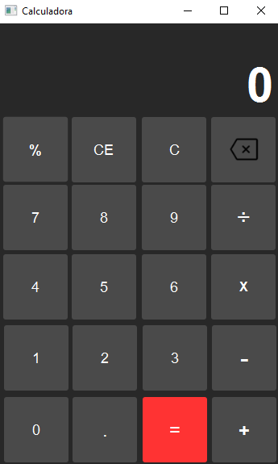
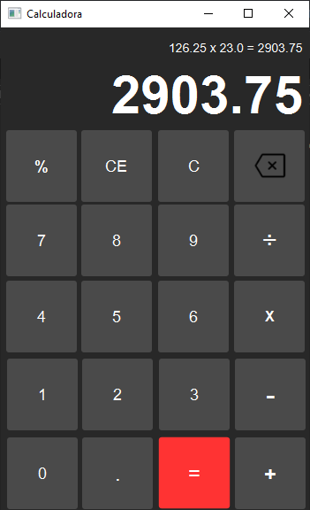

# Calculadora JavaFX

## Descripción
Calculadora JavaFX es una aplicación de escritorio simple desarrollada en Java utilizando JavaFX para la interfaz gráfica de usuario y Java para la lógica. Esta aplicación permite realizar operaciones matemáticas básicas como suma, resta, multiplicación, división y módulo,
con una interfaz amigable y fácil de usar.

## Características
-  Interfaz de usuario moderna y responsiva construida con JavaFX.
-  Soporte para operaciones aritméticas básicas:
    - Suma
    - Resta
    - Multiplicación
    - División
    - Módulo
 
Manejo de errores para entradas inválidas o divisiones por cero.
Visualización clara de los cálculos en curso y el historial de operaciones.

## Capturas de Pantalla

